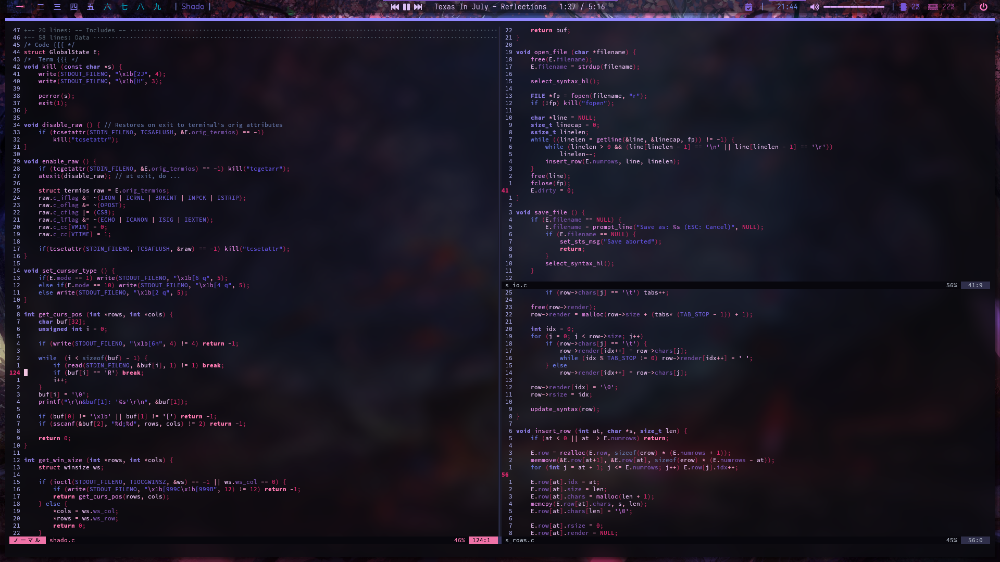

# Hi! I'm Shadorain, you can call me Shado 🤘

Thanks for checking out my profile, hope you find what you are looking for!

I am a programmer heavily invested in Rust mainly and C/C++ when needed. I also love security, operating systems (Linux daily driver), and a bunch of other cool stuff. I'm a big advocate for FOSS (Free and Open Source Software) and am always willing to help with anything that I can help with.

Please feel free to friend or DM me on Discord or shoot me an email! [Who am I](#who-am-i)

## My Tech Workflow

## Who am I

- ◼️ I’m currently working my custom editor and TUI engine in Rust: [Phantom](https://github.com/Shadorain/Phantom) | [Umbra TUI](https://github.com/Shadorain/Umbra)!
- 💻 I’m currently learning more Data Oriented and Structural Programming in Rust!
- 💬 Ask me about anything Rust, C, Neo/vim, Linux, or programming!
- 📱 How to reach me: 
  - Discord: Shadorain#4182
  - EMail: shadorain.elite@gmail.com
- 🎸 Fun fact: I love Christian Metalcore and play a bunch on guitar! Hit me up for some bands!

[)](https://github.com/Shadorain) 

### Dev Projects
   

### Rice Zone
  

